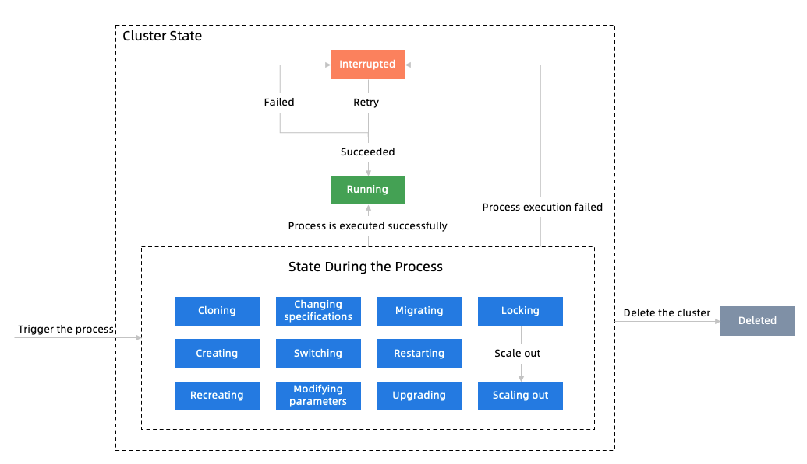

# Workflow Engine

## Background

PolarDB Stack is based on Kubernetes and most of the control component is developed based on the Kubernetes operator. The workflow of the control component is as follows:

1. Firstly, a Kubernetes resource type needs to be defined. Then users can create an instance of this resource type.
2. When the control operator detects modification on the resource instance, reconciliation, the host of the state machine, will be triggered.
3. The state machine detects the current state of the resource and determines whether the state transition is required.
4. Follow the sequential workflow to finish the state transition.

The logic mentioned above has nothing to do with the specific businesses. Therefore, a set of state machines and workflow engines is abstracted for the control component for reuse.


If the workflow is positioned as the business facade layer, it is a relatively unstable layer. For example, methods of assembling processes vary widely according to different output forms of database engines. Therefore, we implement the stable core business in the domain layer, keep the workflow in a pretty thin layer, and invoke the domain layer to assemble processes for businesses.

## Design Goals and Principles

1. Interactive Process Engine
    1. A process can be divided into multiple steps. If any step fails to be executed, it will be retried until the process is interrupted when the number of retries reaches the threshold.
    2. Users can resume the interrupted process and make it continue to execute from the failed step or the first step.
    3. Users can cancel the process and then the process will directly be interrupted. Users can also resume the interrupted process.
    4. External components can assist processes in executing at runtime. For example:
       1. If rw exceptions occur in the process of creating ro nodes, the process can be interrupted by external components.
       2. When the process is interrupted, external components can trigger the process to resume execution if the external conditions meet the requirements.
    5. If a process is interrupted by qualitative exceptions, defining extension actions for different exceptions is supported:
       1. Each qualitative exception corresponds to an error code.
       2. In the application, you can define the subsequent operations for each error code. The operation can be manual intervention or automatic troubleshooting by a program.
       3. If manual intervention is needed, users can define operations guides.
       4. If a program can troubleshoot automatically, the workflow engine will be notified to resume the workflow after the program is triggered and finishes troubleshooting.
    6. The process can be exited at runtime and the state can be persisted. For example: 
       1. You can remove the time-consuming steps from the memory at runtime and the process will enter the waiting state. When external conditions meet the requirements, the process will be triggered to resume the workflow.
       2. External components can monitor the progress of time-consuming actions in real time and send it to the application. After these time-consuming actions are completed, external components will notify the workflow engine to stop waiting and load the process to the memory at runtime for resuming it.
2. Decouple and extend.
    1. Each component is responsible for one task and the responsibility boundary among internal components is clear.
    2. The process engine is decoupled from Kubernetes and it can run independently.
    3. The process engine is decoupled from specific resource types.
    4. The metadata is decoupled and can be saved in the customized format in the database or Kubernetes.
    5. Steps can be customized.
    6. It supports step combination, which means that you can combine small steps into a big step for reusing it in different processes.
    7. It supports defining Hook to trigger custom actions before or after the process or step is executed, such as recording workflow execution records and displaying them in the console.
    8. The core of the workflow is isolated from external dependencies through APIs to reduce the dependence on the underlying components. A set of default APIs are provided to implement isolation based on Kubernetes.


## Principles of Implementation

### State Machine

The state machine engine is used to process the state transition of resources. Here we take the database cluster state shown in the following figure as an example. In this example, a user starts to create a database cluster and the database cluster will be in the creating state. After the database cluster is created successfully, it will be in the running state. If creating a database cluster fails, the cluster will enter the interrupted state.

There are two types of states: stable state and unstable state.

- Stable State: No action will be taken when the resource enters this state, e.g., interrupted and running in the figure below.
- Unstable State: If the resource information is modified in the stable state, the control component needs to take some actions to make the cluster enter the stable state again. In the figure below, states in blue frames are all unstable.

For example, a running cluster takes no action on management and control. When a user requests for changing the specifications, the state machine will detect this event and change the state of the database cluster to "changing specifications". Then the control component starts changing the specifications of the database cluster. After changing is completed, the database cluster will go into the running state (a stable state) again.



The state machine engine needs to contain the following components:

1. StateMachine: an instance of the state machine, which contains two Map.
   1. StateTranslateMap: a state-transition table that stores unstable states that the stable state can be changed to. The key is the stable state.

   2. StateMainEnterMap: a state-action table that stores actions that need to be taken after the process enters a specific state.

2. StateTranslate: state transducer.
   1. eventChecker: It is used to detect whether a state transition event is triggered.

   2. targetState: If eventChecker has detected that a state transition event is triggered, the stable state will be changed to an unstable state.

3. StateMainEnter: state entry.
   1. StableStateMainEnter: entry of the stable state. No business logic will be executed in MainEnter.

   2. UnStableStateMainEnter: entry of the unstable state. The specific business logic will be executed in MainEnter. Different logic needs to be customized for different unstable states such as scaling out and changing specifications.


The following sequence diagram describes the invoking relationship among the components mentioned above.

1. When the control component starts, it will instantiate StateMachine to create an instance and register the stable state, unstable states, entries of states, and the state transducer.
2. By modifying the custom resource (Resource) of Kubernetes, users can submit the instruction for changing specifications.

3. The control operator keeps monitoring resource changes and triggers reconciliation (Reconcile) when it obtains notifications of resource changes.

4. The reconciliation entry executes DoStateMainEnter of StateMachine to enter the workflow.

5. The StateMachine traverses its own StateTranslateMap and executes eventChecker one by one to detect whether a state change is triggered.

6. For specification changes, the state will be changed from running to changing specifications and the MainEnter corresponding to the changing specifications state will be executed.

7. After specification changes, the custom logic will change the resource state and make the database cluster enter the running state.

8. Now reconciliation (Reconcile) will be triggered again.

9. As step 4, DoStateMainEnter of StateMachine is executed.

10. This step is the same as step 5, but now the cluster is in the running state (a stable state).

11. This step is the same as step 6, but now MainEnter of the stable state will be executed, which means no action will be taken.


### Workflow Engine


The workflow engine consists of the workflow core and the API implementation.

1. **Workflow Core:** It encapsulates the stable logic of the workflow and can be executed without Kubernetes.
2. **API Implementation:** The APIs define the interaction between the core and the external systems.  The specific logic needs to be customized by users, such as how to persist metadata, which kind of resources the workflow can interact with, and which steps the process contains. The engine provides a set of default API implementations based on Kubernetes.

The workflow core contains the following components:

1. WorkflowManager: workflow manager.
   1. The specific implementation of APIs will be registered to it during instantiation to let it know how to load the metadata, how to save the runtime data, which Hook methods need to be executed at runtime, and which kind of resources the workflow can interact with.

2. ResourceWorkflow: a process that tracks and manages a certain resource.
   1. It is a process manager of a specific resource instance and is created using the method CreateResourceWorkflow of WorkflowManager. Take the database cluster polar-rwo-762ee1p8q08 as an example. Which processes it has executed, which ones it has finished executing, which ones are still being executed, and starting a new process for the database cluster are all managed by this component.

3. WorkflowRuntime: workflow runtime.
   1. The ResourceWorkflow executes Run(flowName) to start a new process. After the process is started, a WorkflowRuntime instance will be created.

   2. Before the execution of new processes, unfinished old processes need to be executed by RunLastUnCompletedRuntime.

4. StepRuntime: step runtime.
   1. WorkflowRuntime contains multiple StepRuntime.

   2. It will change the step's state (in preparation, initialized, executed, and execution failed) when the step is being executed, record the execution time, number of retries, output results, and check whether the number of retries reaches the threshold.

   3. Each StepRuntime contains one StepActionInstance that represents actions to be taken by this step.

5. MementoCareTaker: It is used to persist the runtime metadata.
   1. It is used to persist the WorkflowRuntime data. During the process of executing steps or processes, the runtime information will all be persisted in the storage. In the scenarios where the control program elects the leader again, restarts, or performs other operations, the metadata can be read for resuming old processes to continue executing.

   2. The GetNotCompleteFlow() is provided to query unfinished processes.


The API definition contains the following components:

1. Resource: The workflow needs to cooperate with resources, search resource information, save the resource state, etc. Here a basic Resource is abstracted. For Kubernetes resources, the KubeResource is defined.
2. Logger: Log API. It defines the basic format of logs without being coupled with any specific log component.

3. Recover: The method of interrupting and resuming the execution of a process. It provides a default implementation DefaultRecover based on Kubernetes.

4. MetaDataLoader: The method of loading workflow metadata. It provides a default implementation DefaultMetaDataLoader and loads the YAML file from the directory.

5. StepAction: Specific actions executed by each step in the process. You need to implement this API in the business code and register it to WorkflowManager.

6. Hook: The Hook method will be triggered when the process is being initialized, when the process is executed or fails to be executed, and before or after a step is executed. A default implementation DefaultHook is provided to record the execution history of processes.

7. MemontoStorage: MementoCareTaker needs to persist the runtime data by MemontoStorage, provides a default implementation DefaultMemontoStorage, and saves the workflow runtime data to the configmap of Kubernetes.


## Use the Workflow Engine

#### 1. Create a StateMachine Instance

```go
var (
	sharedStorageClusterSmOnce       sync.Once
	sharedStorageClusterStateMachine *statemachine.StateMachine
)
func GetSharedStorageClusterStateMachine() *statemachine.StateMachine {
	sharedStorageClusterSmOnce.Do(func() {
		if sharedStorageClusterStateMachine == nil {
			sharedStorageClusterStateMachine = statemachine.CreateStateMachineInstance(ResourceType)
			sharedStorageClusterStateMachine.RegisterStableState(statemachine.StateRunning, statemachine.StateInterrupt, statemachine.StateInit)
		}
	})
	return sharedStorageClusterStateMachine
}
```

#### 2. Create a WorkflowManager Instance

```go
var ResourceType    = "shared"
var WorkFlowMetaDir = ""./pkg/workflow""

var (
	sharedStorageClusterWfOnce    sync.Once
	sharedStorageClusterWfManager *wfengine.WfManager
)

func GetSharedStorageClusterWfManager() *wfengine.WfManager {
	sharedStorageClusterWfOnce.Do(func() {
		if sharedStorageClusterWfManager == nil {
			var err error
			sharedStorageClusterWfManager, err = createWfManager(ResourceType, WorkFlowMetaDir)
			sharedStorageClusterWfManager.RegisterRecover(wfengineimpl.CreateDefaultRecover())
			if err != nil {
				panic(fmt.Sprintf("create %s wf manager failed: %v", ResourceType, err))
			}
		}
	})
	return sharedStorageClusterWfManager
}

func createWfManager(resourceType, workFlowMetaDir string) (wfManager *wfengine.WfManager, err error) {
	wfManager, err = wfengine.CreateWfManager(
		resourceType,
		workFlowMetaDir,
		wfengineimpl.CreateDefaultWfMetaLoader,
		wfengineimpl.CreateDefaultWorkflowHook,
		wfengineimpl.GetDefaultMementoStorageFactory(resourceType, false),
	)
	return
}
```

#### 3. Define the Resource

The resource should implement the following APIs before being used together with the state machine. Therefore, the Kubernetes resources need to be encapsulated.

```go
// resources supporting the state machine
type StateResource interface {
   GetName() string
   GetNamespace() string
   Fetch() (StateResource, error)
   GetState() State
   UpdateState(State) (StateResource, error)
   IsCancelled() bool
}
type MpdClusterResource struct {
	implement.KubeResource
	Logger logr.Logger
}

func (s *MpdClusterResource) GetState() statemachine.State {
	return s.GetMpdCluster().Status.ClusterStatus
}

// UpdateState: update the resources' current states (string)
func (s *MpdClusterResource) UpdateState(state statemachine.State) (statemachine.StateResource, error) {
	so, err := s.fetch()
	mpdCluster := so.Resource.(*v1.MPDCluster)
	mpdCluster.Status.ClusterStatus = state
	if mgr.GetSyncClient().Status().Update(context.TODO(), mpdCluster); err != nil {
		s.Logger.Error(err, "update mpd cluster status error")
		return nil, err
	}
	return so, nil
}

// Update the resource information
func (s *MpdClusterResource) Update() error {
	if err := mgr.GetSyncClient().Update(context.TODO(), s.GetMpdCluster()); err != nil {
		s.Logger.Error(err, "update mpd cluster error")
		return err
	}
	return nil
}

// Fetch: obtain resources again
func (s *MpdClusterResource) Fetch() (statemachine.StateResource, error) {
	return s.fetch()
}

// GetScheme ...
func (s *MpdClusterResource) GetScheme() *runtime.Scheme {
	return mgr.GetManager().GetScheme()
}

func (s *MpdClusterResource) IsCancelled() bool {
	mpd, err := s.fetch()
	if err != nil {
		if apierrors.IsNotFound(err) {
			return true
		}
		return false
	}
	return mpd.Resource.GetAnnotations()["cancelled"] == "true" || mpd.Resource.GetDeletionTimestamp() != nil
}

func (s *MpdClusterResource) fetch() (*MpdClusterResource, error) {
	kubeRes := &v1.MPDCluster{}
	err := mgr.GetSyncClient().Get(
		context.TODO(), types.NamespacedName{Name: s.Resource.GetName(), Namespace: s.Resource.GetNamespace()}, kubeRes)
	if err != nil {
		s.Logger.Error(err, "mpd cluster not found")
		return nil, err
	}
	return &MpdClusterResource{
		KubeResource: implement.KubeResource{
			Resource: kubeRes,
		},
		Logger: s.Logger,
	}, nil
}
```

#### 4. Define the StepBase

You need to implement all the following APIs in all steps.

```go
type StepAction interface {
   Init(map[string]interface{}, logr.Logger) error
   DoStep(context.Context, logr.Logger) error
   Output(logr.Logger) map[string]interface{}
}
```

You can implement a base class StepBase and all steps inherit from StepBase.

```go
type SharedStorageClusterStepBase struct {
	wfengine.StepAction
	Resource *v1.MPDCluster
	Service  *service.SharedStorageClusterService
	Model    *domain.SharedStorageCluster
}

func (s *SharedStorageClusterStepBase) Init(ctx map[string]interface{}, logger logr.Logger) error {
	name := ctx[define.DefaultWfConf[wfdefine.WorkFlowResourceName]].(string)
	ns := ctx[define.DefaultWfConf[wfdefine.WorkFlowResourceNameSpace]].(string)

	kube := &v1.MPDCluster{}
	err := mgr.GetSyncClient().Get(context.TODO(), types.NamespacedName{Name: name, Namespace: ns}, kube)
	if err != nil {
		return err
	}
	s.Resource = kube
	s.Service = business.NewSharedStorageClusterService(logger)
	useModifyClass := false
	if val, ok := ctx["modifyClass"]; ok {
		useModifyClass = val.(bool)
	}
	useUpgradeVersion := false
	if val, ok := ctx["upgrade"]; ok {
		useUpgradeVersion = val.(bool)
	}
	s.Model = s.Service.GetByData(kube, useModifyClass, useUpgradeVersion)
	return nil
}

func (s *SharedStorageClusterStepBase) DoStep(ctx context.Context, logger logr.Logger) error {
	panic("implement me")
}

func (s *SharedStorageClusterStepBase) Output(logger logr.Logger) map[string]interface{} {
	return map[string]interface{}{}
}
```

#### 5. Define the Step

```go
type InitMeta struct {
	wf.SharedStorageClusterStepBase
}

func (step *InitMeta) DoStep(ctx context.Context, logger logr.Logger) error {
	return step.Service.InitMeta(step.Model)
}
```

#### 6. Register the Step

```go
	wfManager := GetSharedStorageClusterWfManager()
	wfManager.RegisterStep(&InitMeta{})
```

#### 7. Register the State Machine

Define the function of detecting the transition from a stable state to an unstable state.

```go
func checkInstall(obj statemachine.StateResource) (*statemachine.Event, error) {
	cluster := obj.(*wf.MpdClusterResource).GetMpdCluster()
	if cluster.Status.ClusterStatus == "Init" || cluster.Status.ClusterStatus == "" || string(cluster.Status.ClusterStatus) == string(statemachine.StateCreating) {
		return statemachine.CreateEvent(statemachine.EventName(statemachine.StateCreating), nil), nil
	}
	return nil, nil
}
```

Define the entry function of the unstable state.

```go
func installMainEnter(obj statemachine.StateResource) error {
	resourceWf, err := wf.GetSharedStorageClusterWfManager().CreateResourceWorkflow(obj)
	if err != nil {
		return err
	}
	return resourceWf.CommonWorkFlowMainEnter(context.TODO(), obj, "CreateSharedStorageCluster", false, checkInstall)
}
```

Register the stable state, the unstable state, the function of detecting the transition from the stable state to the unstable state, and the entry function of the unstable state.

```go
	smIns := GetSharedStorageClusterStateMachine()

	// Register the function of detecting transition from the stable state to the unstable state and the entry function of the unstable state
	smIns.RegisterStateTranslateMainEnter(statemachine.StateInit, checkInstall, statemachine.StateCreating, installMainEnter)
	
```

#### 8. Configure the Process Metadata

```yaml
flowName: CreateSharedStorageCluster
recoverFromFirstStep: false
steps:
  - className: workflow_shared.InitMeta
    stepName:  InitMeta

  - className: workflow_shared.PrepareStorage
    stepName:  PrepareStorage

  - className: workflow_shared.CreateRwPod
    stepName:  CreateRwPod

  - className: workflow_shared.CreateRoPods
    stepName:  CreateRoPods

  - className: workflow_shared.CreateClusterManager
    stepName:  CreateClusterManager

  - className: workflow_shared.AddToClusterManager
    stepName:  AddToClusterManager

  - className: workflow_shared.UpdateRunningStatus
    stepName:  UpdateRunningStatus
```