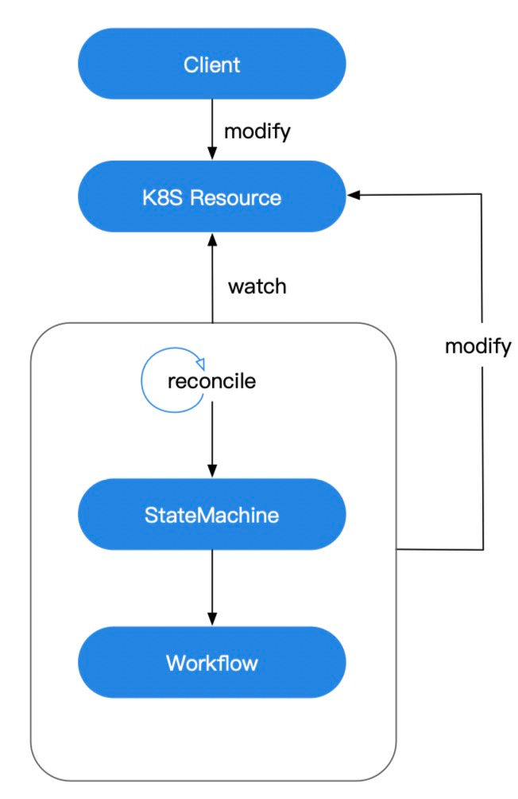
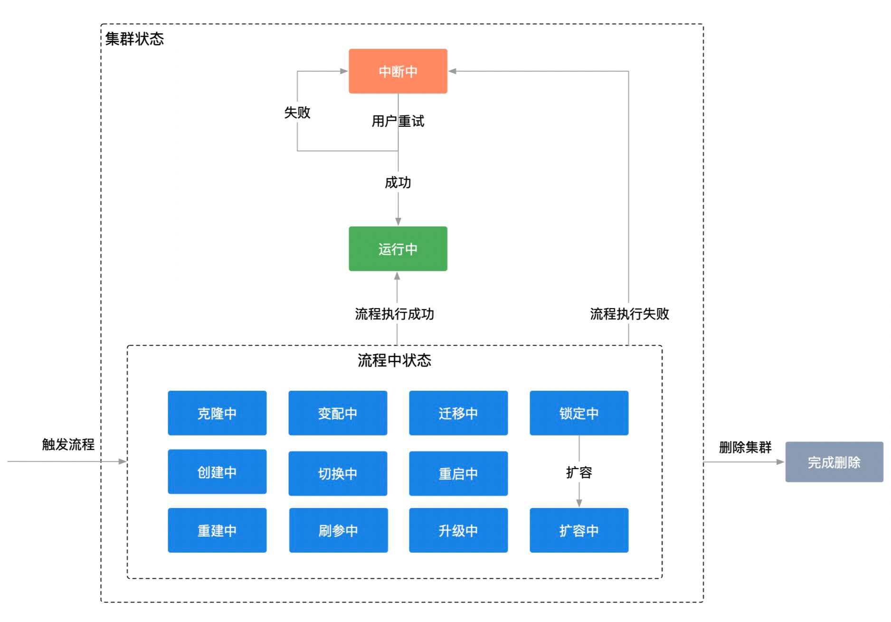
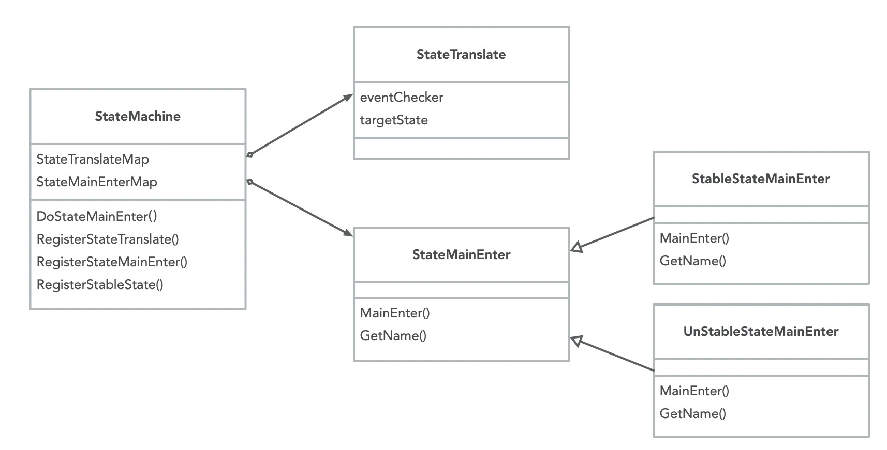
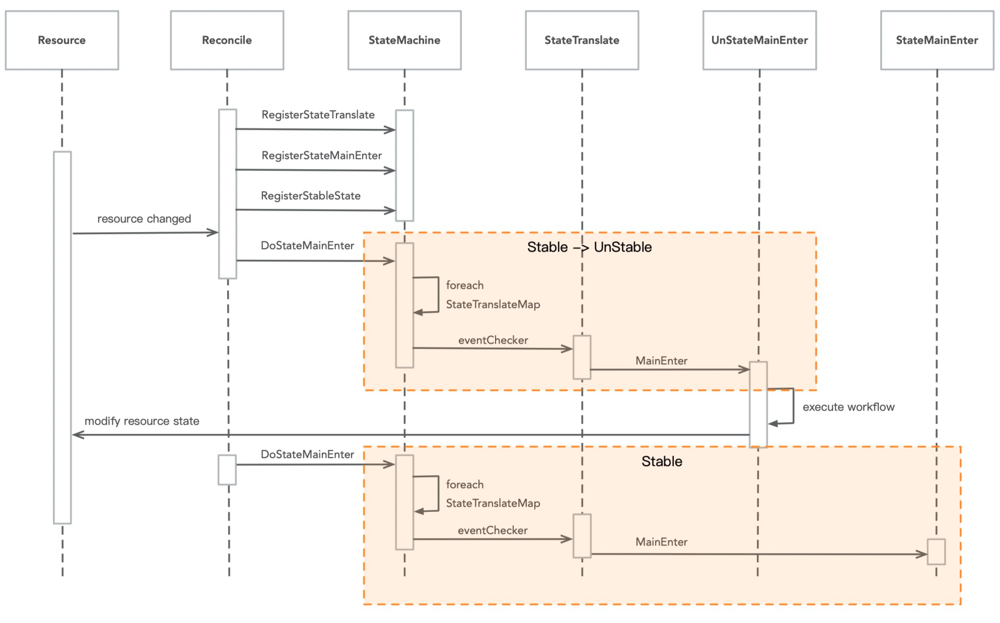
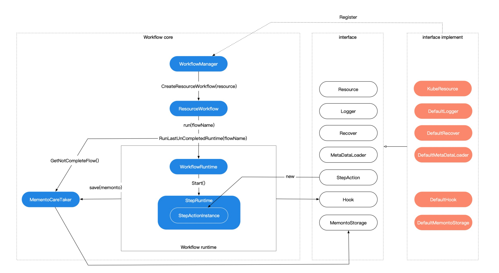

# 工作流引擎

## 背景

PolarDB Stack 使用K8S作为底座，管控组件大部分是基于K8S operator开发的，管控组件的工作流程如下：

1. 首先需要定义一种K8S资源，然后由用户创建该资源的一个实例；
2. 管控Operator监听到资源实例的改动，会触发调谐，调谐是状态机的宿主；
3. 状态机检测当前资源状态，判断是否需要进行状态转换；
4. 使用顺序工作流完成状态转换。

上述逻辑和具体业务无关的，所以管控抽象出一套状态机和工作流引擎，以达到复用的目的。



把工作流定位为业务外观层，是相对不稳定的一层，比如：针对数据库引擎的不同输出形态，流程的组装方式会有很大差异。将稳定的核心业务实现放到领域层，工作流做成很薄的一层，调用领域层做业务组装。

## 设计目标与原则

1. 交互式流程引擎
    1. 一个流程分为多个步骤，步骤失败可以自动重试，达到重试阈值后中断。
    2. 用户可以恢复中断的流程，使其从失败步骤继续执行，或者从第一步重试。
    3. 用户可以取消流程，使流程直接进入中断状态，并可恢复。
    4. 外部组件辅助流程运行时执行。比如：

1. 1. a. 在创建ro过程中，rw异常，可由外部组件通知流程中断。

2. b. 流程处于中断状态时，在外部条件满足时，也可由外部组件触发流程继续。

1. 5. 可定性的异常造成的中断，支持针对不同异常定义扩展行为：

1. 1. a. 每种定性异常都对应一个错误码。

2. b. 应用侧针对每种错误码可以定义后续操作，是必须人工介入，还是可以有程序自动排除故障。

1. 1. c. 如果是需要人工介入，用户侧可以定义操作指引。

2. d. 如果有程序可以自动排除故障，程序触发并排除完故障后，可以通知流程引擎继续执行。

1. 6. 流程运行时支持退出，状态可持久化。比如：

1. 1. a. 长耗时步骤，运行时可以从内存卸载，流程进入waiting状态，外部条件满足时再触发运行时恢复。

2. b. 外部组件可以实时采集长耗时动作的进度，并反馈给应用，完成后通知流程引擎结束waiting，运行时加载到内存中继续执行。

2. 解耦和扩展

1. a. 单一职责，内部组件有明确的职责边界。

2. b. 流程引擎与K8S解耦，可以独立运行。

1. c. 流程引擎与具体的资源类型解耦。

2. d. 元数据解耦，可以定制保存形式，保存至数据库或者K8S。

1. e. 可以自定义步骤。

2. f. 支持步骤组合，将小粒度步骤组合成一个大步骤，在不同流程中复用。

1. g. 支持定义钩子，流程和步骤执行前后触发自定义行为，比如记录工作流执行记录，在控制台显示。

2. h. 工作流核心与外部依赖通过接口隔离，降低对底层组件的依赖，提供一套默认的接口实现（基于K8S实现）

## 实现原理

### 状态机

状态机引擎用于处理资源状态流转，以下图的DB集群状态为例：用户提交了创建动作，DB集群会处于创建中，等待创建成功后，集群会处于运行中，如果创建失败，集群会进入中断状态。

状态分为两大类：稳定态和非稳定态。

- 稳定态：资源进入该状态后，不会执行任何动作。比如：下图中的中断中、运行中。
- 非稳定态：在稳定状态下，外界修改了资源信息，导致需要管控执行一些动作，使集群可以再次进入稳定态。下图蓝色部分，都是非稳定态。

例如：一个运行中的集群，不会执行任何管控动作，用户提交了一个变配请求，状态机检测到该事件，会将DB集群状态变为变配中，此时管控开始变更DB集群规格，等完成后，DB集群再次进入运行中这个稳定态。



状态机引擎需要包含以下组件：

1. StateMachine：状态机实例，其中包含两个Map

1. a. StateTranslateMap 状态转换表，保存着稳定态可以转换到哪些非稳定态，key是稳定态。

2. b. StateMainEnterMap 状态行为表，保存着进入到某状态后需要执行的行为。

1. StateTranslate 状态转换器

1. a. eventChecker 用于检测是否触发了某个状态转换事件。

2. b. targetState 如果eventChecker检测触发了某个事件，状态将由稳定态转换为非稳定态。

1. StateMainEnter 状态入口

1. a. StableStateMainEnter 稳定态入口，MainEnter中不会执行任何业务逻辑。

2. b. UnStableStateMainEnter 非稳定态入口，MainEnter中执行具体的业务逻辑。此处需要自定义实现，比如扩容中状态、变配中状态，都是需要执行不同逻辑的。



通过下面的时序图说明上面几个组件之间的调用关系：

1. 管控在启动时实例化StateMachine的一个实例，并且注册稳定态及非稳定态、状态入口、状态转换器。
2. 用户通过更改k8s自定义资源（Resource）提交变配指令。

3. 管控operator一直在监听资源变化，它拿到资源变化的通知，触发调谐（Reconcile）。

4. 调谐入口执行StateMachine的DoStateMainEnter，进入工作流入口。

5. StateMachine遍历自己的StateTranslateMap，并按个执行eventChecker，检测是否触发了状态变更。

6. 针对变配场景，状态会由运行中转换为变配中，并且执行变配状态对应的MainEnter。

7. 变配执行完，自定义实现的逻辑中会更改资源状态，使DB集群进入“运行中”。

8. 此时会再次进入调谐。

9. 同第4步，执行StateMachine的DoStateMainEnter。

10. 同第5步，但此时集群处于运行中，是稳定态。

11. 同第6步，但此时会执行稳定态MainEnter，即不会有任何行为。




### 工作流引擎



工作流引擎由两大部分组成：工作流核心和接口实现

1. **工作流核心：**工作流核心封装了工作流的稳定逻辑。可以脱离K8S执行。
2. **接口实现：**接口部分定义了核心与外界的交互。包括元数据如何持久化、工作流与哪类资源交互、流程包含哪些步骤等，这些都是需要使用方自定义的逻辑。引擎提供了一套基于K8S的默认接口实现。

工作流核心部分包含以下组件：

1. WorkflowManager：工作流管理器

1. 在实例化时将接口的具体实现注册给它，让它知道元数据如何加载、运行时数据如何保存、运行时执行哪些Hook方法，工作流与哪类资源进行交互。

2. ResourceWorkflow：跟踪和管理某个资源的流程

1. 通过WorkflowManager的CreateResourceWorkflow方法创建，是某个特定资源实例的流程管理器。比如：polar-rwo-762ee1p8q08这个DB集群，执行过哪些流程，哪些已经执行完，哪个流程还在执行中，包括为该DB集群启动一个新流程，都是由这个组件管理的。

3. WorkflowRuntime：工作流运行时

1. a. ResourceWorkflow执行Run(flowName)，可以启动一个新流程，流程启动后会产生一个WorkflowRuntime实例。

2. b. 在新流程执行前，都要通过RunLastUnCompletedRuntime方法将未完成的旧流程执行完。

1. StepRuntime：步骤运行时

1. a. WorkflowRuntime包含多个StepRuntime。

2. b. 它会在步骤执行过程中更改步骤状态（准备中、初始化完成、执行完成、执行失败），记录执行时间、重试次数、输出结果，判断是否达到重试阈值。

1. c. 每个StepRuntime中包含一个StepActionInstance，代表该步骤要执行的动作。

1. MementoCareTaker：用于运行时元数据持久化

1. a. 用于WorkflowRuntime数据持久化，在步骤执行、流程执行过程中都会将运行时信息持久化到存储，在管控程序重新选主、程序重启等场景下，可以读取元数据，恢复旧流程的执行。

2. b. 提供GetNotCompleteFlow()方法，查询未完成的流程。

接口定义部分包含以下组件：

1. Resource：工作流需要与资源进行协作，查询资源信息、保存资源状态等，这里抽象出一个基础的Resource。针对K8S资源，定义了一个KubeResource。
2. Logger：日志接口。不和特定的日志组件耦合，并定义日志的基础格式。

3. Recover：如何中断及恢复流程的执行。提供一个基于K8S的默认实现DefaultRecover

4. MetaDataLoader：如果加载工作流元数据。提供一个默认实现DefaultMetaDataLoader，从目录加载yaml。

5. StepAction：每个流程步骤执行的具体动作，需要在业务代码中实现该接口，并注册到WorkflowManager。

6. Hook：流程初始化、执行完成、执行失败、步骤执行前后都会触发该接口定义的钩子方法。提供一个默认实现DefaultHook，用于记录流程执行历史。

7. MemontoStorage：MementoCareTaker需要通过MemontoStorage持久化运行时数据，提供一个默认实现DefaultMemontoStorage，将工作流运行时数据保存到K8S的configmap中。


## 使用工作流引擎

#### 1. 创建StateMachine实例

```go
var (
	sharedStorageClusterSmOnce       sync.Once
	sharedStorageClusterStateMachine *statemachine.StateMachine
)
func GetSharedStorageClusterStateMachine() *statemachine.StateMachine {
	sharedStorageClusterSmOnce.Do(func() {
		if sharedStorageClusterStateMachine == nil {
			sharedStorageClusterStateMachine = statemachine.CreateStateMachineInstance(ResourceType)
			sharedStorageClusterStateMachine.RegisterStableState(statemachine.StateRunning, statemachine.StateInterrupt, statemachine.StateInit)
		}
	})
	return sharedStorageClusterStateMachine
}
```

#### 2. 创建WorkflowManager实例

```go
var ResourceType    = "shared"
var WorkFlowMetaDir = ""./pkg/workflow""

var (
	sharedStorageClusterWfOnce    sync.Once
	sharedStorageClusterWfManager *wfengine.WfManager
)

func GetSharedStorageClusterWfManager() *wfengine.WfManager {
	sharedStorageClusterWfOnce.Do(func() {
		if sharedStorageClusterWfManager == nil {
			var err error
			sharedStorageClusterWfManager, err = createWfManager(ResourceType, WorkFlowMetaDir)
			sharedStorageClusterWfManager.RegisterRecover(wfengineimpl.CreateDefaultRecover())
			if err != nil {
				panic(fmt.Sprintf("create %s wf manager failed: %v", ResourceType, err))
			}
		}
	})
	return sharedStorageClusterWfManager
}

func createWfManager(resourceType, workFlowMetaDir string) (wfManager *wfengine.WfManager, err error) {
	wfManager, err = wfengine.CreateWfManager(
		resourceType,
		workFlowMetaDir,
		wfengineimpl.CreateDefaultWfMetaLoader,
		wfengineimpl.CreateDefaultWorkflowHook,
		wfengineimpl.GetDefaultMementoStorageFactory(resourceType, false),
	)
	return
}
```

#### 3. 定义Resource

资源要实现以下接口才能配合状态机使用，所以需要对K8S资源做一下封装。

```go
// 支持状态机的资源
type StateResource interface {
   GetName() string
   GetNamespace() string
   Fetch() (StateResource, error)
   GetState() State
   UpdateState(State) (StateResource, error)
   IsCancelled() bool
}
type MpdClusterResource struct {
	implement.KubeResource
	Logger logr.Logger
}

func (s *MpdClusterResource) GetState() statemachine.State {
	return s.GetMpdCluster().Status.ClusterStatus
}

// UpdateState 更新资源当前状态(string)
func (s *MpdClusterResource) UpdateState(state statemachine.State) (statemachine.StateResource, error) {
	so, err := s.fetch()
	mpdCluster := so.Resource.(*v1.MPDCluster)
	mpdCluster.Status.ClusterStatus = state
	if mgr.GetSyncClient().Status().Update(context.TODO(), mpdCluster); err != nil {
		s.Logger.Error(err, "update mpd cluster status error")
		return nil, err
	}
	return so, nil
}

// 更新资源信息
func (s *MpdClusterResource) Update() error {
	if err := mgr.GetSyncClient().Update(context.TODO(), s.GetMpdCluster()); err != nil {
		s.Logger.Error(err, "update mpd cluster error")
		return err
	}
	return nil
}

// Fetch 重新获取资源
func (s *MpdClusterResource) Fetch() (statemachine.StateResource, error) {
	return s.fetch()
}

// GetScheme ...
func (s *MpdClusterResource) GetScheme() *runtime.Scheme {
	return mgr.GetManager().GetScheme()
}

func (s *MpdClusterResource) IsCancelled() bool {
	mpd, err := s.fetch()
	if err != nil {
		if apierrors.IsNotFound(err) {
			return true
		}
		return false
	}
	return mpd.Resource.GetAnnotations()["cancelled"] == "true" || mpd.Resource.GetDeletionTimestamp() != nil
}

func (s *MpdClusterResource) fetch() (*MpdClusterResource, error) {
	kubeRes := &v1.MPDCluster{}
	err := mgr.GetSyncClient().Get(
		context.TODO(), types.NamespacedName{Name: s.Resource.GetName(), Namespace: s.Resource.GetNamespace()}, kubeRes)
	if err != nil {
		s.Logger.Error(err, "mpd cluster not found")
		return nil, err
	}
	return &MpdClusterResource{
		KubeResource: implement.KubeResource{
			Resource: kubeRes,
		},
		Logger: s.Logger,
	}, nil
}
```

#### 4. 定义StepBase

所有step都要实现以下接口：

```go
type StepAction interface {
   Init(map[string]interface{}, logr.Logger) error
   DoStep(context.Context, logr.Logger) error
   Output(logr.Logger) map[string]interface{}
}
```


可以实现一个StepBase基类，所有Step继承自StepBase：

```go
type SharedStorageClusterStepBase struct {
	wfengine.StepAction
	Resource *v1.MPDCluster
	Service  *service.SharedStorageClusterService
	Model    *domain.SharedStorageCluster
}

func (s *SharedStorageClusterStepBase) Init(ctx map[string]interface{}, logger logr.Logger) error {
	name := ctx[define.DefaultWfConf[wfdefine.WorkFlowResourceName]].(string)
	ns := ctx[define.DefaultWfConf[wfdefine.WorkFlowResourceNameSpace]].(string)

	kube := &v1.MPDCluster{}
	err := mgr.GetSyncClient().Get(context.TODO(), types.NamespacedName{Name: name, Namespace: ns}, kube)
	if err != nil {
		return err
	}
	s.Resource = kube
	s.Service = business.NewSharedStorageClusterService(logger)
	useModifyClass := false
	if val, ok := ctx["modifyClass"]; ok {
		useModifyClass = val.(bool)
	}
	useUpgradeVersion := false
	if val, ok := ctx["upgrade"]; ok {
		useUpgradeVersion = val.(bool)
	}
	s.Model = s.Service.GetByData(kube, useModifyClass, useUpgradeVersion)
	return nil
}

func (s *SharedStorageClusterStepBase) DoStep(ctx context.Context, logger logr.Logger) error {
	panic("implement me")
}

func (s *SharedStorageClusterStepBase) Output(logger logr.Logger) map[string]interface{} {
	return map[string]interface{}{}
}
```

#### 5. 定义Step

```go
type InitMeta struct {
	wf.SharedStorageClusterStepBase
}

func (step *InitMeta) DoStep(ctx context.Context, logger logr.Logger) error {
	return step.Service.InitMeta(step.Model)
}
```


#### 6. 注册Step

```go
	wfManager := GetSharedStorageClusterWfManager()
	wfManager.RegisterStep(&InitMeta{})
```

#### 7. 注册状态机

定义稳定态到非稳定态的转换检测函数

```go
func checkInstall(obj statemachine.StateResource) (*statemachine.Event, error) {
	cluster := obj.(*wf.MpdClusterResource).GetMpdCluster()
	if cluster.Status.ClusterStatus == "Init" || cluster.Status.ClusterStatus == "" || string(cluster.Status.ClusterStatus) == string(statemachine.StateCreating) {
		return statemachine.CreateEvent(statemachine.EventName(statemachine.StateCreating), nil), nil
	}
	return nil, nil
}
```

定义非稳定态入口函数

```go
func installMainEnter(obj statemachine.StateResource) error {
	resourceWf, err := wf.GetSharedStorageClusterWfManager().CreateResourceWorkflow(obj)
	if err != nil {
		return err
	}
	return resourceWf.CommonWorkFlowMainEnter(context.TODO(), obj, "CreateSharedStorageCluster", false, checkInstall)
}
```

注册稳定态、非稳定态、稳定态到非稳定态的转换检测函数、非稳定态入口函数

```go
	smIns := GetSharedStorageClusterStateMachine()

	// 注册稳定态到非稳定态的转换检测及非稳定态的入口
	smIns.RegisterStateTranslateMainEnter(statemachine.StateInit, checkInstall, statemachine.StateCreating, installMainEnter)
	
```

#### 8. 配置流程元数据

```yaml
flowName: CreateSharedStorageCluster
recoverFromFirstStep: false
steps:
  - className: workflow_shared.InitMeta
    stepName:  InitMeta

  - className: workflow_shared.PrepareStorage
    stepName:  PrepareStorage

  - className: workflow_shared.CreateRwPod
    stepName:  CreateRwPod

  - className: workflow_shared.CreateRoPods
    stepName:  CreateRoPods

  - className: workflow_shared.CreateClusterManager
    stepName:  CreateClusterManager

  - className: workflow_shared.AddToClusterManager
    stepName:  AddToClusterManager

  - className: workflow_shared.UpdateRunningStatus
    stepName:  UpdateRunningStatus
```